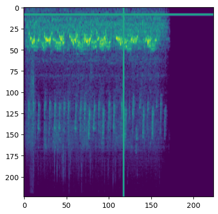
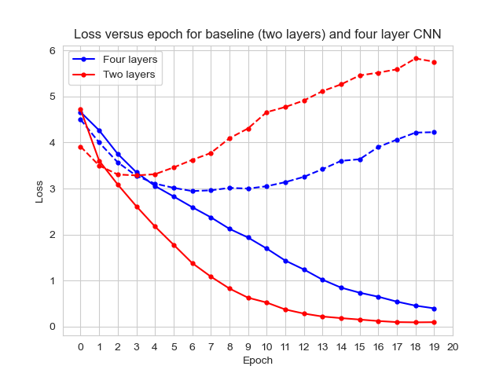

# Bird species identification on audio samples using CNNs (BirdCLEF 2024)

## Authors
[Amzi Jeffs](https://github.com/AmziJeffs)    
[Junichi Koganemaru](https://github.com/jkoganem)  
[Salil Singh](https://github.com/sllsnghlrns)  
[Ashwin Tarikere](https://github.com/ashwintan1)     

## Overview

Climate change plays a devastating role in the destruction of natural habitats and the global decline of biodiversity. One way of understanding these effects is by monitoring bird populations as they are highly migratory and have diverse habitual needs. However, traditional methods can be costly and logistically challenging to conduct at large scales. 

In this project we explore using passive acoustic monitoring (PAM) combined with deep learning methods to identify bird specifies using audio samples in the Western Ghats of India. The broader goal of this project is for the authors to learn to use [PyTorch](https://pytorch.org) and to contribute to the growing literature of deep learning approaches to tackling issues brought by climate change. 

## Structure of repository

- `all scripts` folder contains scripts for all the architectures and preprocessing steps that we have been considering.  
- `data` folder contains the training metadata. .py scripts in the scripts folders can be ran locally after populating the `data` folder with the official training audio data. 
- `sample scripts` folder contains sample scripts showcasing our work. Included are 
    - [EDAbaseline.ipynb](/sample%20scripts/EDAbaseline.ipynb) for exploratory data analysis and a simple training pipeline.
    - [baseline.ipynb](/sample%20scripts/baseline.ipynb) and [baseline.py](/sample%20scripts/baseline.py) for a two-layer baseline model with minimal preprocessing. 
    - [6layerNN.py](/sample%20scripts/) for a six-layer CNN model with improved preprocessing.
    - [convnext.py](/sample%20scripts/convnext.py) and [resnet.py](/sample%20scripts/resnet.py) for transfer learning with ResNet and ConvNeXT. 

#### Remark
The scripts are written to be ran on a remote cluster with considerable computing power. As written, the training data is loaded into memory to speed up runtime performance, which requires significant RAM usage. Simple modifications can be made for the scripts to be utilized locally. 
## Description of dataset

We use the dataset provided by the [BirdCLEF 2024 competition](https://www.kaggle.com/competitions/birdclef-2024), hosted on Kaggle. We are asked to train a model reporting probabilities of the presence of 182 given bird species in hidden test set of ~1100 audio clips; each test clip contains potentially multiple bird calls. 

The metadata for the training audio samples can be found under the [`data`](data/test_metadata.csv) folder. The rest of the data are available on [the official competition webpage](https://www.kaggle.com/competitions/birdclef-2024/data).   
 
## Evaluation metric

The model is evaluated using a macro-averaged ROC-AUC metric on a hidden testing set provided by the organizers; see [the official documentation](https://www.kaggle.com/competitions/birdclef-2024/overview/evaluation) for more details. 

## Progress 
- [x] Exploratory data analysis
- [x] Building baseline model 
- [x] Improving baseline model 
- [x] Submission for Erdös institute capstone project (deadline 6/1/24) 
- [ ] Improving data preprocessing and augmentation, model architecture and inference speed
- [ ] Submission for Kaggle competition (deadline 6/10/24)

## Exploratory data analysis
The training metadata provides the coordinates of the audio samples. From the following plot we can see that the training data is geographically diverse. 

We very quickly realized that there is an imbalance in the training data by species. This can be seen by plotting the number of clips available and the total duration of clips per species.

## Mel Spectrogram generation and data augmentation
We used the `torchaudio` package supplied by PyTorch to transform the training audio clips to mel spectrograms as inputs into convolutional neural networks. 

  

We later found that data augmentation techniques such as applying time and frequency masks and increasing/decreasing contrast via exponentiation help the models generalize better on test data. 

## Baseline architecture 

Our baseline architecture is a simple two-layer convolutional neural network that takes in mel spectralgrams as inputs and returns logits as outputs. The outputs are then transformed via a sigmoid activation function in the Kaggle submission notebook for final submission. 

We found that baseline and similar models have a tendency to overfit on training data.

Improving data preprocessing and model architecture significantly reduced overfitting. 

We are currently working on further optimizing data preprocessing and the neural network aritecture to optimize performance.  

## Acknowledgement 

We would like to thank the organizers and the associated organizations of the BirdCLEF 2024 competition for hosting the competition. We would also like to thank all the current and past participants for sharing their insights on the Kaggle discussion forums. We learned a tremendous amount from reading the approaches of past submissions and ideas shared by current participants. 

We would like to thank the Erdös institute for providing the authors the opportunity to work on this project as part of the Erdös institute Data Science Bootcamp. 

We would also like to thank Nuno Chagas and the Department of Mathematical Sciences at Carnegie Mellon University for providing computing support for the project. 

## References 
- Holger Klinck, Maggie, Sohier Dane, Stefan Kahl, Tom Denton, Vijay Ramesh. (2024). BirdCLEF 2024. Kaggle. https://kaggle.com/competitions/birdclef-2024
- Valerio Velardo. PyTorch for audio tutorial series. 2021. https://github.com/musikalkemist/pytorchforaudio/tree/main  

